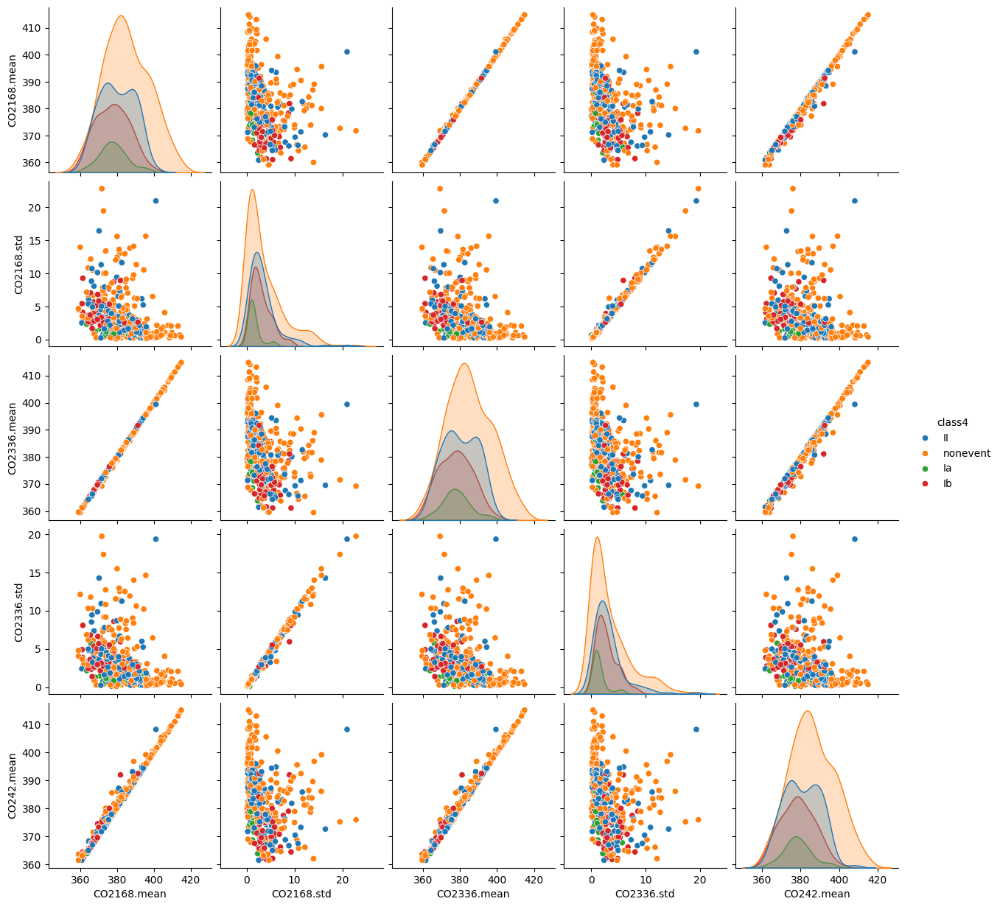

```{r setup, include=FALSE}
knitr::opts_chunk$set(echo = FALSE)
```

# Introduction

Check the [Github Repo](https://github.com/HeljaeRaeisaenen/IML_project) for the source code and additional plots.

Special information about the project: we started as a team of three people, but, unfortunately, my two teammates had to leave the course. Initially, we agreed on using Python and its libraries such as numpy, pandas, etc. to do the project, but now I am switching to R, because I am more familiar with it in data science context. However, some preliminary work such as exploratory data analysis was done using Python in Jupyter Notebook, and this is why the Github repository contains both `.Rmd` and `.ipynb` project files. Now, the primary programming language is R and `project.Rmd` is the main project source code file.

## Custom functions

Under this section, I will define custom functions that I used in this project and provide their code snippets.

### Perplexity

```{r, echo=TRUE}
perplexity <- function(p, true) {
  exp(-mean(log(p)))
}
```

### Alpha and lambda selection for binary glmnet

This function will be used to automatically perform selection of optimal value of $\alpha \in$ {0, 0.5, 1} and $\lambda$ based on the smallest MSE from 10-cross-fold validation using `cv.glmnet`. This is used in selection of models for performing multiclass logistic regression. 

```{r, echo=TRUE}
alpha.lambda <- function(data.x, y) {
  X <- model.matrix(~ ., data = data.x)[, -1]

  foldid <- sample(1:10, size=length(y), replace=TRUE)
  alphas <- c(1, 0.5, 0)
  results <- data.frame(alpha = alphas, lambda.min = NA, cvm.min = NA)
  
  for (i in seq_along(alphas)) {
    cv <- cv.glmnet(X, y, alpha=alphas[i], nfolds=10, foldid = foldid)
    results$lambda.min[i] <- cv$lambda.min
    results$cvm.min[i] <- min(cv$cvm)
  }

  best <- results[which.min(results$cvm.min), ]
  
  list(alpha = best$alpha, lambda = best$lambda.min)
}
```

### Multiclass logistic

This function performs multiclass logistic regression using given parameters for a `glmnet` model and returns the most probable class for the test data as well as the full matrix of class probabilities.

```{r, echo=TRUE}
logistic.multiclass <- function(train.x, train.y, test, alphas, lambdas, classes) {
  results <- matrix(data=NA, nrow=nrow(test), ncol=length(classes))
  
  X <- model.matrix(~ ., data = train.x)[, -1]
  test.matrix <- model.matrix(~ ., data=test)[, -1]

  for (i in seq_along(classes)) {
    fit <- glmnet(X, train.y[, i], family="binomial", alpha=alphas[i], lambda=lambdas[i])
    pred <- predict(fit, newx = test.matrix, type="response")
    results[, i] <- pred
  }
  
  # Index of max probability per row
  max_id <- max.col(results, ties.method = "first")
  # Assign class
  predicted <- classes[max_id]
  return(list(prob = results, predicted = predicted))
}
```


# Preprocessing

As a part of preprocessing the data, we need to remove unnecessary columns such as `date`, `id`, and `partlybad`. We also need to encode our class values as numeric values. First, when dealing with binary classification, we can encode *nonevent* as 0 and *any event* as 1.

In a multiclass setting, preprocessing of response values can vary depending on the method used. For example, multinomial regression that we use later requires classes to be parsed through a `factor` function to make them categorical. I assume this method to be a default in the most classification methods in R.

Later, in preprocessing for multiclass logistic regression for "one-vs-all" one class out of four was encoded as 1 and the rest as 0.

```{r}
test <- read.csv("test.csv")

npf <- read.csv("train.csv")
npf <- subset(npf, select=-c(date, id, partlybad))

test.ids <- test$id
test <- subset(test, select=-c(date, id, partlybad))

vars <- colnames(npf)
vars <- vars[! vars %in% c('class4')]

y.binary <- ifelse(npf$class4 == "nonevent", 0, 1)
y.multi <- factor(npf$class4)
```

## Normalization

We can also normalize our data, because generally normalizing yields more stable results in some classification algorithms such as SVMs or logistic regression. This however can depend on an algorithm, but we can try classification both with and without normalization and compare the results.

```{r}
npf.scaled <- as.data.frame(scale(npf[, vars]))
```

# Data Exploration

This task was done using Python and the Seaborn library.

My main task in data exploration was to produce pairplots of variables in the data set to study possible collinearity issues and get more understanding of data overall. However, there is a problem in studying pairplots: we have 100 variables! To deal with this problem, I decided to plot pairplots of 5 variables at a time. Unfortunately, this reduced the number of predictors we can view at the same time, but was useful in the sense of readability. As a result, I produced in total of 20 pairplot images which are saved as `.png` files in the `plots` folder in the Github repository.

I also did a mistake in code once, which produced a pairplot image of 20 variables at the same time. It was unintended, but I saved the image in the `plots` folder anyway, because it gave some broader insight into the variables.



As we see from the generated images, there is a large amount of features that are highly linearly correlated, some of them producing strictly linear plots. We will have to address this issue in the feature selection process.

## Pearson Correlation Coefficient

We can construct a correlation matrix between all variables to further detect correlations.

```{r}
corr <- cor(npf[, vars])
thr <- 0.7

corr_df <- which(abs(corr) > thr, arr.ind = TRUE)
# Remove diagonal and duplicates
corr_df <- corr_df[corr_df[, 1] < corr_df[, 2], ]

result <- data.frame(
  var1 = rownames(corr)[corr_df[, 1]],
  var2 = colnames(corr)[corr_df[, 2]],
  corr = corr[corr_df]
)

table(result$var2)
```

In this table, we see how many times a variable appears in a pair of highly correlated predictors whose Pearson correlation is > 0.7. There are too many correlated pairs to print them all at once, so I decided only to print their counts.

## Feature selection

As we noticed from the pairplots, the data has significant amount of collinear variables. We can use different methods to detect collinearity problems further. For the time being, I decided to use feature selection method already embedded in model training algorithm later, such as Lasso implemented in `glmnet` library to be used in logistic regression scenario.


# Binary classification

In this section, will try and compare different models.

## Logistic Regression

### Setup

Because standard `glm` has convergence issues on the full dataset as described in the VIF section, I will be using `glmnet` library and experiment with different values of $\alpha$ to see what gives the best accuracy on the validation set. I will be using k-fold cross validation to measure each model's squared loss and mean absolute error to choose the best-performing model. I will choose k=10 and CV implementation by the R library `glmnet`. I will try values of $\alpha$ = 0, 0.5 and 1.

I will use the scaled data set, because logistic regression usually performs better with scaled data.

```{r}
library(glmnet)
```
```{r}
X <- model.matrix(~ ., data = npf.scaled)[, -1]
y <- y.binary

foldid <- sample(1:10, size=length(y), replace=TRUE)

cv1 <- cv.glmnet(X, y, alpha=1, nfolds=10, type.measure = "mse", foldid = foldid)
cv.5 <- cv.glmnet(X, y, alpha=0.5, nfolds=10, type.measure = "mse", foldid = foldid)
cv0 <- cv.glmnet(X, y, alpha=0, nfolds=10, type.measure = "mse", foldid = foldid)
```

We can plot MSE based on values of $\log \lambda$ and choose the best value of $\alpha$.

```{r}
plot(log(cv1$lambda), cv1$cvm, pch=19, col="red", xlab="log(lambda)", ylab="MSE")
points(log(cv.5$lambda), cv.5$cvm, pch=19, col="purple")
points(log(cv0$lambda), cv0$cvm, pch=19, col="blue")
legend(
  x = "topleft",
  legend = c("alpha=1", "alpha=0.5", "alpha=0"),
  pch = 19,
  col = c("red", "purple", "blue")
)
```
According to the plot, the absolute lowest MSE is reached by $\alpha=1$. We can also compare the lowest values of MSE by code:

```{r}
print("Lowest MSE when alpha=1:")
cv1$cvm[cv1$lambda == cv1$lambda.min]
print("Lowest MSE when alpha=0.5:")
cv.5$cvm[cv.5$lambda == cv.5$lambda.min]
print("Lowest MSE when alpha=0:")
cv0$cvm[cv0$lambda == cv0$lambda.min]
```

So, to fit our model, we choose $\alpha=1$ and the lambda that gives the minimum MSE in `cv1`.

### Accuracy and perplexity

We can estimate the accuracy of our classification by choosing a number of random validation sets and training the model with selected parameters on the rest of the training set. I will run the code to select a random training (50%) and validation (50%) sets and estimate the accuracy as well the perplexity, using our custom defined `perplexity` function.

```{r}
n <- floor(0.5*nrow(npf.scaled))
J <- 100
acc.binary.lr <- numeric(J)
perp.lr <- numeric(J)

for (i in 1:J) {
  picked <- sample(seq_len(nrow(npf.scaled)), size = n)

  train <- npf.scaled[picked, vars]
  valid <- npf.scaled[-picked, vars]
  y.valid <- y.binary[-picked]
  
  X.train <- model.matrix(~ ., data = train)[, -1]
  y.train <- y.binary[picked]

  model <- glmnet(X.train, y.train, family="binomial", alpha=1, lambda=cv1$lambda.min)

  valid.matrix <- model.matrix(~ ., data=valid)[, -1]
  valid.pred <- predict(model, newx=valid.matrix, type="response")
  pred <- ifelse(valid.pred >= 0.5, 1, 0)
  
  acc.binary.lr[i] <- mean(pred == y.valid)
  perp.lr[i] <- perplexity(valid.pred)
}
```

```{r}
par(mfrow=c(1, 2))
hist(acc.binary.lr, xlab="Accuracy", main="Accuracy, logistic regression")
hist(perp.lr, xlab="Perplexity", main="Perplexity. logistic regression")
```
We can expect our accuracy to be between 0.86 - 0.88 on average, and perplexity around 4 - 8.

### The resulting model

After training the model on the full train data set, we get the following fit:

```{r}
model.binary <- glmnet(X, y, family="binomial", alpha=1, lambda=cv1$lambda.min)
```
```{r}
print(model.binary)
```
Here, Df stands for the number of nonzero coefficients, %dev is the percent deviance explained and Lambda is the value of $\lambda$ used.

## KNN

to do

## SVM

to do

# Multiclass classification

## Logistic regression

There are different ways to approach multiclass classification with logistic regression. One can utilize a ready-to-run multinomial algorithm such as multinomial family in the `glmnet` library that can deal with multiple classes. Another possible solution is to train several models using binary logistic regression and make them "fight" against each other either in one-vs-one or one-vs-all settings. First, we will try the easiest option to setup: multinomial glmnet.

### Multinomial glmnet

Additionally to the parameter $\alpha$, the multinomial regression has a parameter $q \in$ {1, 2}. $q=1$ means lasso penalties for each parameter and $q=2$ means a grouped lasso penalty on all the coefficients of a variable. We will try both values and assess which one works better for our data set using `cv.glmnet` as in the binary classification task with K = 10, as well as testing different values of $\alpha \in$ {1, 0.5, 0}. We will use the scaled data set.

After running the code for both values of q and all three values of alpha, I've had convergence issues with $\alpha = 1, q = 1$, $\alpha = 1, q = 2$, $\alpha = 0.5, q = 2$. So, we will remove these models from the test and compare the rest which did not have convergence issues.

```{r}
X <- model.matrix(~ ., data = npf.scaled)[, -1]
y <- y.multi

foldid <- sample(1:10, size=length(y), replace=TRUE)

cv.5q1 <- cv.glmnet(X, y, alpha=0.5, nfolds=10, type.measure = "mse", foldid = foldid, family="multinomial", type.multinomial="ungrouped")
cv0q1 <- cv.glmnet(X, y, alpha=0, nfolds=10, type.measure = "mse", foldid = foldid, family="multinomial", type.multinomial="ungrouped")

cv0q2 <- cv.glmnet(X, y, alpha=0, nfolds=10, type.measure = "mse", foldid = foldid, family="multinomial", type.multinomial="grouped")
```

Now, we can plot MSE based on values of $\log \lambda$ and choose the best value of $\alpha$ and $q$.

```{r}
plot(log(cv.5q1$lambda), cv.5q1$cvm, pch=19, col="red", xlab="log(lambda)", ylab="MSE")
points(log(cv0q1$lambda), cv0q1$cvm, pch=19, col="purple")
points(log(cv0q2$lambda), cv0q2$cvm, pch=19, col="blue")
legend(
  x = "topleft",
  legend = c("alpha=0.5, q=1", "alpha=0, q=1", "alpha=0, q=2"),
  pch = 19,
  col = c("red", "purple", "blue")
)
```
```{r}
print("Lowest MSE when alpha=0.5, q=1:")
cv.5q1$cvm[cv.5q1$lambda == cv.5q1$lambda.min]
print("Lowest MSE when alpha=0, q=1:")
cv0q1$cvm[cv0q1$lambda == cv0q1$lambda.min]
print("Lowest MSE when alpha=0, q=2:")
cv0q2$cvm[cv0q2$lambda == cv0q2$lambda.min]
```
Based on these criteria, we will choose parameters $\alpha=0.5, q=1$.

Estimating accuracy:

```{r}
n <- floor(0.5*nrow(npf.scaled))
J <- 30
acc.multi1 <- numeric(J)

for (i in 1:J) {
  picked <- sample(seq_len(nrow(npf.scaled)), size = n)

  train <- npf.scaled[picked, ]
  valid <- npf.scaled[-picked, ]
  y.valid <- y.multi[-picked]
  
  X.train <- model.matrix(~ ., data = train)[, -1]
  y.train <- y.multi[picked]

  model <- glmnet(X.train, y.train, family="multinomial", alpha=0.5, lambda=cv.5q1$lambda.min, type.multinomial="ungrouped")

  valid.matrix <- model.matrix(~ ., data=valid)[, -1]
  valid.pred <- predict(model, newx=valid.matrix, type="class")
  
  acc.multi1[i] <- mean(valid.pred == y.valid)
}
```

```{r}
hist(acc.multi1, xlab="Accuracy", main="Expected accuracy from multinomial classification")
```
We can expect our multinomial classification accuracy to be on average between 0.62 and 0.68.

Then, we can fit the model on the full data set:

```{r}
model.multi <- glmnet(X, y, family="multinomial", alpha=0.5, lambda=cv.5q1$lambda.min, type.multinomial="ungrouped")
print(model.multi)
```

### Logistic regression

We can setup our logistic regression to give predictions in a multiclass setting. We can use either "one-vs-all" or "one-vs-one" strategy. One-vs-all is easier to setup, se we will try this one first. We will use the scaled data set first, and then try the unscaled.

**One-vs-all**

In this strategy, we will train four separate logistic regression models using `glmnet`: *nonevent vs. rest*, *Ia vs. rest*, *Ib vs. rest*, *II vs. rest*. We will use the same strategy as in binary classification problem to choose the appropriate value of $\alpha$ for each model. After that, we will run our test data set through all four models and assign class with the largest probability.

- *nonevent vs. rest*

This one is similar to the binary classification of nonevent vs. event, but in this case our model will give the probability of *nonevent* instead of probability of *event*.

```{r}
y.m.non.rest <- ifelse(npf$class4 == "nonevent", 1, 0)
al1 <- alpha.lambda(npf.scaled, y.m.non.rest)
alpha1 <- al1[[1]]
lambda1 <- al1[[2]]
print(paste0("Nonevent vs. rest: alpha=", alpha1, " lambda=", lambda1))
```

- *Ia vs. rest*

```{r}
y.m.ia.rest <- ifelse(npf$class4 == "Ia", 1, 0)
al2 <- alpha.lambda(npf.scaled, y.m.ia.rest)
alpha2 <- al2[[1]]
lambda2 <- al2[[2]]
print(paste0("Ia vs. rest: alpha=", alpha2, " lambda=", lambda2))
```

- *Ib vs. rest*

```{r}
y.m.ib.rest <- ifelse(npf$class4 == "Ib", 1, 0)
al3 <- alpha.lambda(npf.scaled, y.m.ib.rest)
alpha3 <- al3[[1]]
lambda3 <- al3[[2]]
print(paste0("Ib vs. rest: alpha=", alpha3, " lambda=", lambda3))
```

- *II vs. rest*

```{r}
y.m.ii.rest <- ifelse(npf$class4 == "II", 1, 0)
al4 <- alpha.lambda(npf.scaled, y.m.ii.rest)
alpha4 <- al4[[1]]
lambda4 <- al4[[2]]
print(paste0("II vs. rest: alpha=", alpha4, " lambda=", lambda4))
```

*Accuracy estimation*

```{r}
alphas <- c(alpha1, alpha2, alpha3, alpha4)
lambdas <- c(lambda1, lambda2, lambda3, lambda4)
classes <- c("nonevent", "Ia", "Ib", "II")
```

```{r}
n <- floor(0.5*nrow(npf.scaled))
J <- 70
acc.multi2 <- numeric(J)

for (i in 1:J) {
  picked <- sample(seq_len(nrow(npf.scaled)), size = n)

  train <- npf.scaled[picked, ]
  valid <- npf.scaled[-picked, ]

  y.train1 <- y.m.non.rest[picked]
  y.train2 <- y.m.ia.rest[picked]
  y.train3 <- y.m.ib.rest[picked]
  y.train4 <- y.m.ii.rest[picked]
  y <- cbind(y.train1, y.train2, y.train3, y.train4)
  
  y.valid <- npf$class4[-picked]

  res <- logistic.multiclass(train, y, valid, alphas, lambdas, classes)
  
  acc.multi2[i] <- mean(y.valid == res$predicted)
}
```

```{r}
hist(acc.multi2, xlab="Accuracy", main="Expected accuracy from one-vs-all logistic regression (scaled)")
```
Expected accuracy is comparable to multinomial regression. Next, we will try follow the same steps with unscaled data.

*Accuracy estimation (unscaled)*

```{r}
al1 <- alpha.lambda(npf[, vars], y.m.non.rest)
alpha1 <- al1[[1]]
lambda1 <- al1[[2]]
print(paste0("Nonevent vs. rest: alpha=", alpha1, " lambda=", lambda1))
```

- *Ia vs. rest*

```{r}
al2 <- alpha.lambda(npf[, vars], y.m.ia.rest)
alpha2 <- al2[[1]]
lambda2 <- al2[[2]]
print(paste0("Ia vs. rest: alpha=", alpha2, " lambda=", lambda2))
```

- *Ib vs. rest*

```{r}
al3 <- alpha.lambda(npf[, vars], y.m.ib.rest)
alpha3 <- al3[[1]]
lambda3 <- al3[[2]]
print(paste0("Ib vs. rest: alpha=", alpha3, " lambda=", lambda3))
```

- *II vs. rest*

```{r}
al4 <- alpha.lambda(npf[, vars], y.m.ii.rest)
alpha4 <- al4[[1]]
lambda4 <- al4[[2]]
print(paste0("II vs. rest: alpha=", alpha4, " lambda=", lambda4))
```

*Accuracy estimation*

```{r}
alphas2 <- c(alpha1, alpha2, alpha3, alpha4)
lambdas2 <- c(lambda1, lambda2, lambda3, lambda4)
```

```{r}
n <- floor(0.5*nrow(npf))
J <- 70
acc.multi3 <- numeric(J)

for (i in 1:J) {
  picked <- sample(seq_len(nrow(npf)), size = n)

  train <- npf[picked, vars]
  valid <- npf[-picked, vars]

  y.train1 <- y.m.non.rest[picked]
  y.train2 <- y.m.ia.rest[picked]
  y.train3 <- y.m.ib.rest[picked]
  y.train4 <- y.m.ii.rest[picked]
  y <- cbind(y.train1, y.train2, y.train3, y.train4)
  
  y.valid <- npf$class4[-picked]

  res <- logistic.multiclass(train, y, valid, alphas2, lambdas2, classes)
  
  acc.multi3[i] <- mean(y.valid == res$predicted)
}
```

```{r}
hist(acc.multi3, xlab="Accuracy", main="Expected accuracy from one-vs-all logistic regression (unscaled)")
```
We notice that on average, this one-vs-all classifier performs better on unscaled data.

## KNN

to do

## SVM (one-vs-one, one-vs-all)

to do

# Applying on the test data

**Submission 1:** Unscaled Logistic regression for binary classification, Unscaled Multinomial regression for multiclass classification. Kaggle score: **0.75559**
**Submission 2:** Unscaled Logistic regression for binary classification, Unscaled Logistic regression (one-vs-all) for multiclass classification. Kaggle score: **0.76250**
**Submission 3:** Scaled Logistic regression for binary classification, Scaled Multinomial regression for multiclass classification. Kaggle score: **0.74645**

```{r}
b.model <- model.binary
m.model <- model.multi

test.x <- model.matrix(~ ., data=as.data.frame(scale(test)))[, -1]

#train.y <- cbind(y.m.non.rest, y.m.ia.rest, y.m.ib.rest, y.m.ii.rest)
#res.test <- logistic.multiclass(npf[, vars], train.y, test, alphas, lambdas, classes)

#cls4 <- res.test$predicted
cls4 <- predict(model.multi, newx = test.x, type = "class")
ps <- predict(model.binary, newx = test.x, type = "response")

result_df <- data.frame(id=test.ids, class4=cls4, p=ps)
#colnames(result_df)[colnames(result_df) == 's0'] <- 'p'
colnames(result_df)[colnames(result_df) == 's0'] <- 'class4'
colnames(result_df)[colnames(result_df) == 's0.1'] <- 'p'

write.csv(result_df, "submission.csv")
```


# Results

```{r}
rows <- c("Scaled Logistic Regression (LR)", "Scaled LR (one-vs-all)", "Unscaled LR (one-vs-all)", "Multinomial Regression")

accs.b <- c(mean(acc.binary.lr), NaN, NaN, NaN)
accs.m <- c(NaN, mean(acc.multi2), mean(acc.multi3), mean(acc.multi1))
perps <- c(mean(perp.lr), NaN, NaN, NaN)
kaggle <- c(0.74645, NaN, 0.76250, 0.75559)

table.df <- data.frame(
  Model = rows,
  'Bin.accuracy' = accs.b,
  'Mult.accuracy' = accs.m,
  Perplexity = perps,
  'Kaggle.score' = kaggle,
  stringsAsFactors = FALSE
)

knitr::kable(table.df)
```

After trying both scaled and unscaled data on Logistic Regression and Multinomial Regression, I notices with surprise that unscaled data produced better results on average. My first two submissions I used unscaled data on both binary and multiclass classification, which gave much better Kaggle score than the third submission with scaled data. Also, the average perplexity was estimated lower in unscaled data cases than in scaled. In case of unscaled data for multiclass problem, one-vs-all Logistic Regression did better then Multinomial. With scaled data, however, Multinomial Regression managed to get slightly more accuracy on average.

Future work: mark difference between scaled and unscaled data more clearly in the report; try other ML algorithms such as KNN and SVM.